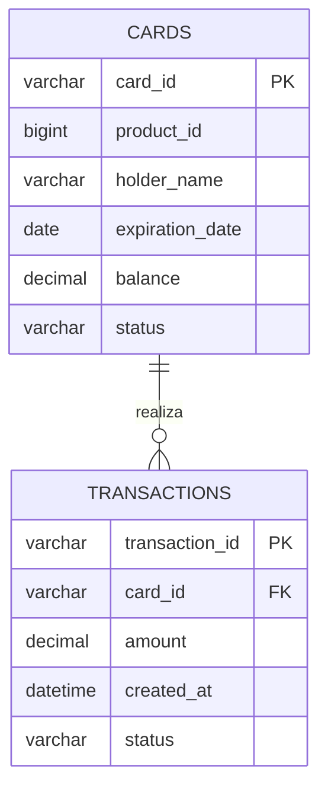

# Modelo de datos

```mermaid
erDiagram
    CARDS {
        varchar card_id PK
        bigint product_id
        varchar holder_name
        date expiration_date
        decimal balance
        varchar status
    }

    TRANSACTIONS {
        varchar transaction_id PK
        varchar card_id FK
        decimal amount
        datetime created_at
        varchar status
    }

    CARDS ||--o{ TRANSACTIONS : "realiza"
```

La relación lógica es `cards.card_id -> transactions.card_id`.
